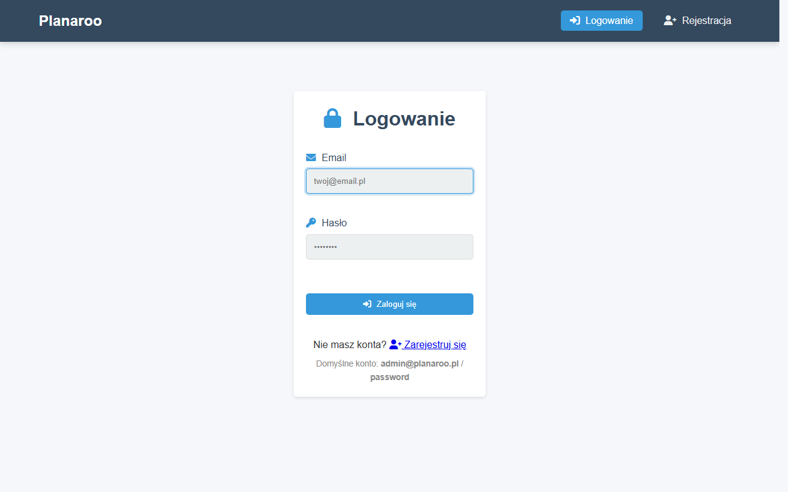
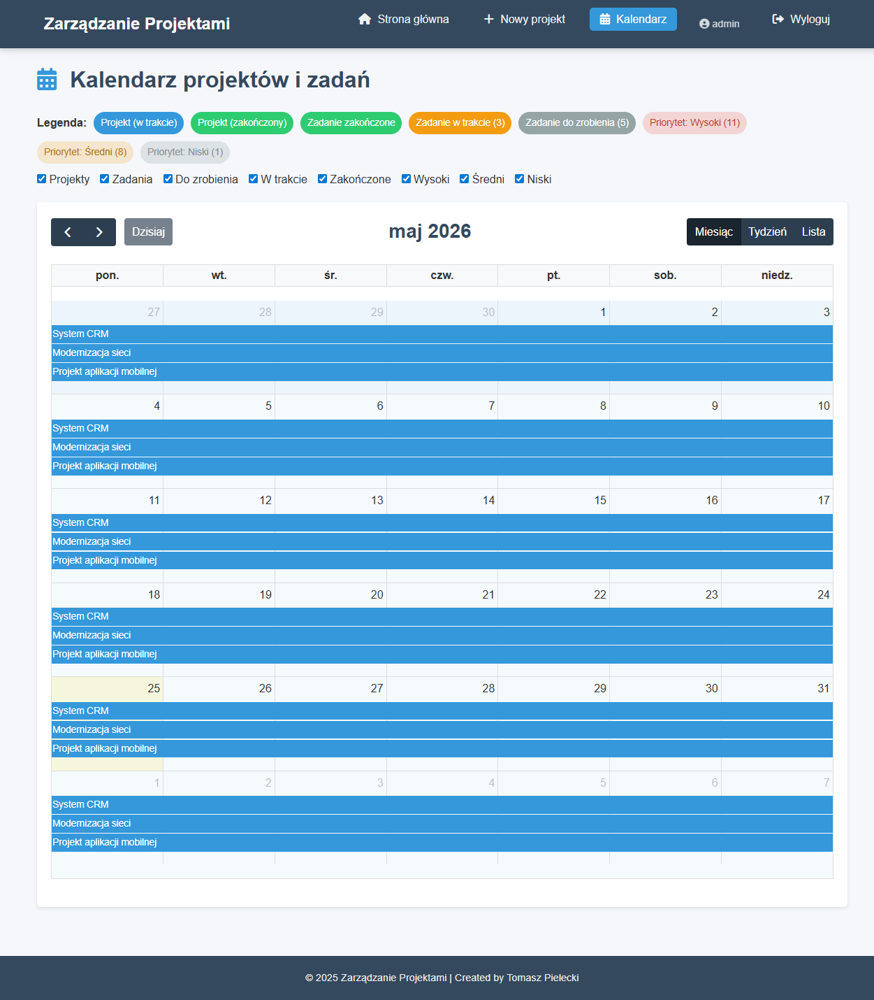
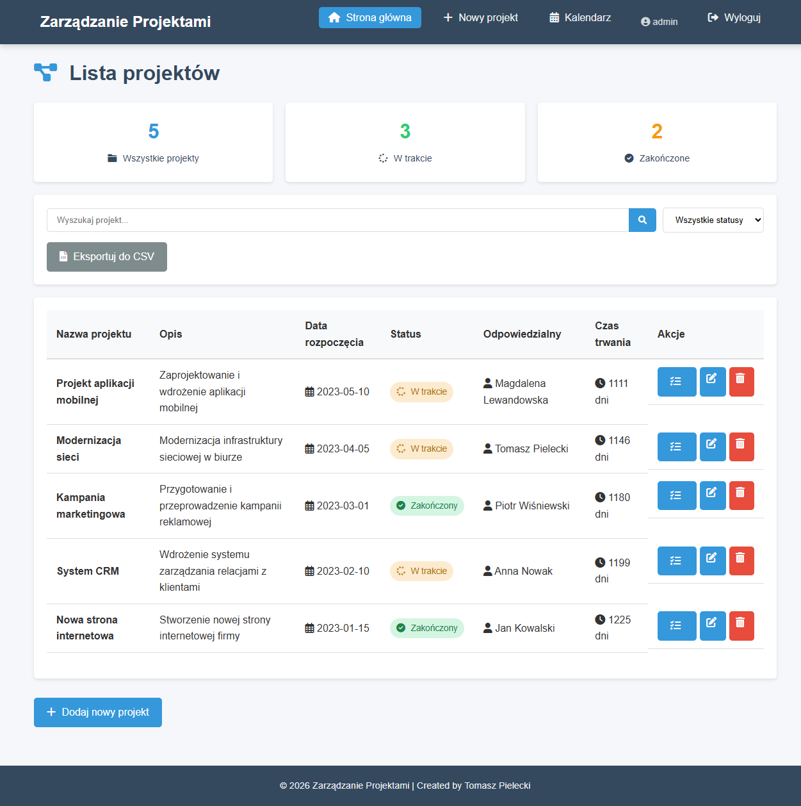

# Planaroo - System Zarządzania Projektami

Planaroo to kompleksowe rozwiązanie do zarządzania projektami i zadaniami, stworzone z myślą o małych i średnich firmach. System umożliwia efektywne planowanie, monitorowanie oraz raportowanie postępów projektów. Obsługuje logowanie użytkowników i działa zarówno na SQLite (domyślnie), jak i MySQL.

## Funkcjonalności

### Logowanie i rejestracja użytkowników
- Bezpieczne logowanie i rejestracja (hasła bcrypt)
- Ochrona wszystkich funkcji przed niezalogowanymi użytkownikami
- Domyślne konto administratora: `admin@planaroo.pl` / `password`

### Zarządzanie Projektami

- Tworzenie nowych projektów z określeniem nazwy, opisu, dat rozpoczęcia/zakończenia
- Przypisywanie osób odpowiedzialnych za realizację projektu
- Śledzenie statusu projektów (w trakcie, zakończony)
- Edycja i usuwanie projektów
- Widok kalendarza projektów

### Zarządzanie Zadaniami

- Dodawanie zadań do projektów
- Określanie terminów realizacji zadań
- Przypisywanie priorytetów (niski, średni, wysoki)
- Śledzenie statusu zadań
- Przypisywanie osób odpowiedzialnych

### Śledzenie Czasu Pracy

- Rejestrowanie czasu pracy nad zadaniami
- Dodawanie komentarzy do wpisów czasu pracy
- Raportowanie łącznego czasu pracy dla zadania
- Usuwanie wpisów czasu pracy

### Raportowanie i Eksport

- Eksport danych projektów do formatu CSV
- Eksport zadań do formatu CSV
- Statystyki projektów
- Powiadomienia o zbliżających się terminach zadań

## Technologia

- **Backend**: PHP 8.2+
- **Frontend**: HTML, CSS, JavaScript
- **Szablony**: Smarty
- **Baza danych**: SQLite (domyślnie, automatyczna inicjalizacja) lub MySQL
- **Biblioteki**: FontAwesome, FullCalendar

## Struktura Projektu

- `/controllers` - Kontrolery obsługujące logikę biznesową
- `/models` - Modele zarządzające dostępem do danych
- `/config` - Pliki konfiguracyjne
- `/css` - Arkusze stylów
- `/libs` - Biblioteki (Smarty, autoloader)
- `/inc` - Dodatkowe pliki (np. SQL)
- `/smarty/templates` - Szablony Smarty
- `/screenshots` - Zrzuty ekranu aplikacji

## Instalacja

1. Sklonuj repozytorium na serwer z PHP 8.2+ (np. XAMPP, Laragon, built-in serwer PHP)
2. Wejdź do katalogu projektu i uruchom serwer:  
	`php -S localhost:8080`
3. Otwórz w przeglądarce: [http://localhost:8080](http://localhost:8080)
4. Domyślne konto administratora:  
	Email: `admin@planaroo.pl`  
	Hasło: `password`

Nie musisz ręcznie zakładać bazy — plik SQLite utworzy się automatycznie przy pierwszym uruchomieniu.

## Zrzuty ekranu

| Logowanie | Projekty | Zadania |
|-----------|----------|---------|
|  |  |  |

| Kalendarz | Śledzenie czasu | Dodawanie projektu |
|-----------|----------------|--------------------|
|  |  |  |

## Plany rozwoju

### Krótkoterminowe (1-3 miesiące)

- Implementacja uprawnień dostępu (role: administrator, kierownik projektu, pracownik)
- Dodanie funkcji filtrowania i sortowania zadań
- Rozbudowa modułu kalendarza o widok tygodniowy i miesięczny
- Optymalizacja interfejsu dla urządzeń mobilnych

### Średnioterminowe (3-6 miesięcy)

- Implementacja systemu powiadomień (email, wewnątrz aplikacji)
- Dodanie modułu budżetowania projektów
- Implementacja systemu komentarzy do projektów i zadań
- Dodanie funkcji załączników (dokumenty, obrazy) do projektów i zadań
- Rozbudowa mechanizmu raportowania o wykresy i dashboardy

### Długoterminowe (6+ miesięcy)

- Integracja z zewnętrznymi kalendarzami (Google Calendar, Microsoft Outlook)
- Implementacja API REST do integracji z innymi systemami
- Dodanie modułu zarządzania zasobami (przydzielanie zasobów do projektów)
- Implementacja systemu workflow dla projektów i zadań
- Rozwój aplikacji mobilnej (iOS, Android)

## Autor

Tomasz Pielecki

## Licencja

Projekt jest własnością intelektualną autora i nie może być używany bez wyraźnej zgody.

---

© 2025 Planaroo - System Zarządzania Projektami